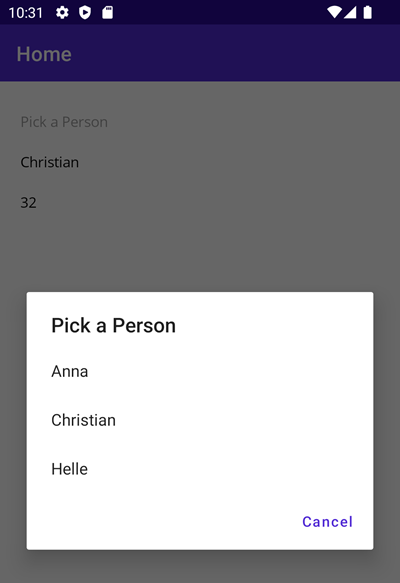

# 1.BasicViewModel

Dette eksempel viser en Picker med 3 personer, hvor man kan vælge en og få vist Name og Age:



Klassen `MainPageViewModel.cs` indeholder de to properties `Name` og `Age`, som View'et binder til. Desuden er der implementeret INPC for begge properties samt for `PersonSelectedItem`.

Både klasserne MainPage MainPageViewModel skal instantieres via DI som Singleton, hvilket gøres i MauiProgram.cs:

```csharp
builder.Services.AddSingleton<MainPage>();
builder.Services.AddSingleton<MainPageViewModel>();
```

Desuden skal View's BindingContext sættes til ViewModel-objektet, hvilket sker i View'et vha. constructor DI-injection:

```csharp
public MainPage(MainPageViewModel vm)
{
    InitializeComponent();
    BindingContext = vm;
}
```

